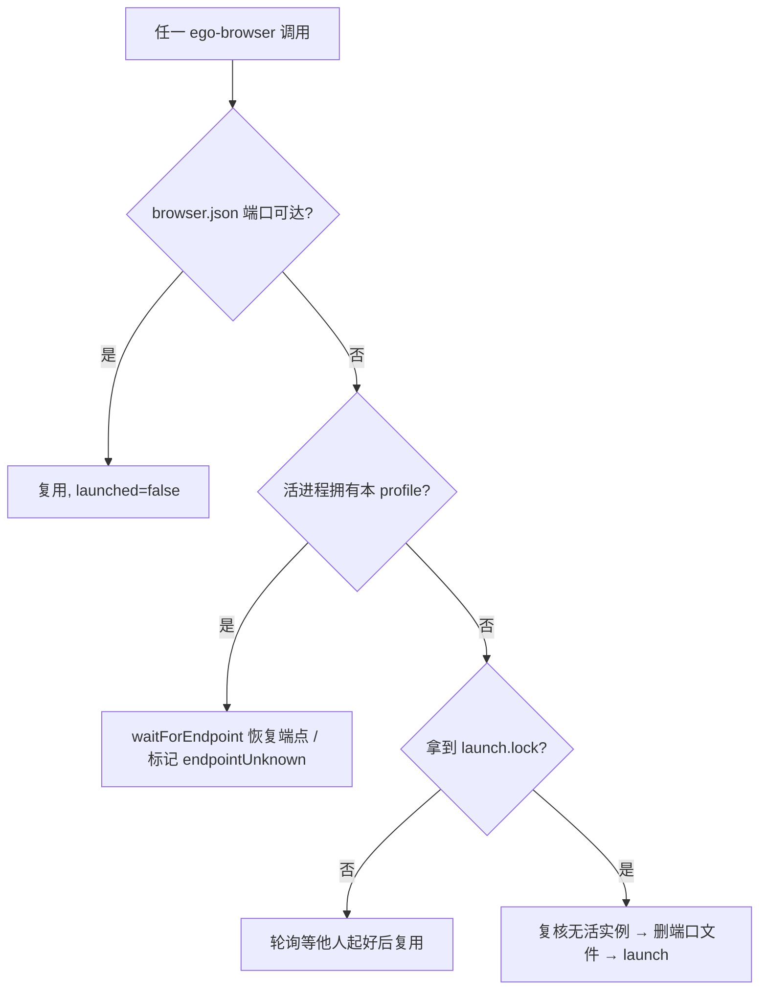

# ego-browser 命令化 + 单实例设计（2026-08-16）

> 状态：设计已获用户认可，进入实现（用户授权自动完成，出门在外）。
> 说明：本仓库当前不是 git 仓库（`git status` 报 `not a git repository`），
> 因此本设计文档无法按惯例 `git commit`；写入后即视为落盘。
> 与同日另一份 `2026-08-16-ego-browser-interaction-optimization-design.md`
> （handoff / 复用 / 稳定执行主题）互补，主题不同。

## 1. 背景与问题

在 2026-08-16 会话（百度 → bilibili → 播放第一支视频）之后复盘，用户提出两个仍有优化空间的方向：

1. **接口混乱：Agent 仍会被引导去"找脚本位置"**
   - `SKILL.md` / `windows.md` / `operating-preferences.md` 大量以
     `node scripts\ego-browser-launch.mjs ...` 为主展示方式，Agent 倾向于去
     repo 里搜 launch 脚本路径，而不是用已配置到 PATH 的 `ego-browser` 命令
     （`bin\ego-browser.cmd`）。
   - 期望：**`ego-browser` 是唯一入口**；不在 PATH 就停下给安装指引，绝不自行
     搜索脚本路径。

2. **浏览器多开（多个独立 Chrome 进程组）始终没根治**
   - 触发场景（用户确认）：先 `--open` 预热、再跑真实任务时，出现**多个独立
     Chrome 进程组**。
   - 代码级根因（Windows 专属）：
     - `ensureBrowser()` 判定"浏览器是否还活着"只靠 `probe()`（1.5s 超时）；
       冷启动慢或 `browser.json` 过期时会把**活实例**误判为已死。
     - `clearProfileLock()` 判断"锁持有者是否存活"用 `ownsOurProfile()`，它只读
       `/proc/<pid>/cmdline`，**Windows 上恒返回 false** → 不杀旧进程，但
       **无条件 `rm` 三个 Singleton 锁文件** → 活实例 A 的 ProcessSingleton 被毁。
     - 之后 `launch()` spawn 的 B 无法通过 ProcessSingleton 交接给 A → B 成为
       第二个独立实例，与 A 同时占同一 profile。
     - `reapOrphanedBrowsers()` 读 `/proc`，Windows 恒返回 0 → 孤儿不回收。
     - 「读状态→判定→启动」无跨进程互斥 → 并行调用可同时两次 `launch()`。

## 2. 目标

- `ego-browser` 成为唯一命令入口；不再出现"去找脚本位置"。
- 任意触发（`--open` 预热误用、并行调用、连跑 heredoc、`--stop` 后再启）都保证
  **单实例**：检测以 Windows 原生进程为准，检测到活实例就复用/重连，绝不新开。
- 补充验证：新增单实例回归检查，用证据证明多开不再发生。

## 3. 范围

- **做**：接口统一（文档 + 安装脚本自动加 PATH + cmd 加固）；`chrome.mjs`
  单实例根因修复（登记 `runtime/PATCHES.md`）；`verify-single-instance.mjs`。
- **不做**：`--doctor` 诊断命令（用户未选）；`--import-chrome-profile` 与
  cookie 回流逻辑（2026-08-16 已修，本次不动）；对已存在多开的自动合并回收
  （YAGNI，根因堵住后不再产生新的）。
- **预热立场**：不需要预热。无登录 → 冷启动直达；有登录 → `--open` 登录一次后
  立即 `--stop` 关闭落盘再跑任务。文档把"不预热"写成明确规则。

## 4. 设计

### 4.1 接口统一：`ego-browser` 唯一入口

- `skills/ego-browser/SKILL.md`
  - frontmatter 描述字段的启动示例改为 `ego-browser nodejs`。
  - Invocation 节重写：所有示例以 `ego-browser` 为准；新增硬规则——只用 PATH 上
    的 `ego-browser`，不要搜索/拼接 repo 里 launch 脚本路径；命令不存在就停止并
    提示把 `bin\` 加 PATH（或跑安装脚本）。
- `skills/ego-browser/references/windows.md`：命令示例全改 `ego-browser ...`；
  保留"launcher 为何存在"的解释但结论为"用户只需要 `ego-browser`"；
  Troubleshooting 相应行更新。
- `skills/ego-browser/references/operating-preferences.md`：速记命令改
  `ego-browser ...`；新增"不预热"明确规则。
- `skills/ego-browser/references/install.md`：注明安装脚本会自动把 `bin\` 加进
  用户 PATH（幂等，仍可手动加）。
- `skills/ego-browser/scripts/install.ps1` 与 `scripts/install-copilot-skill.ps1`：
  各加幂等的 `Add-EgoBrowserToPath`（`[Environment]::SetEnvironmentVariable(...,'User')`，
  去重、提示新终端生效）。
- `bin/ego-browser.cmd`：Node 缺失时给中文友好提示；保留 `%~dp0` 定位。
- `README.md`：常用命令表改为 `ego-browser` 优先，新增单实例验证命令。

### 4.2 多开修复（`runtime/ego-linux/src/chrome.mjs`，登记 PATCHES.md）

新增/修改：

1. **`enumerateOwnBrowserMainProcesses(profileDir)`**（win32）：PowerShell
   `Get-CimInstance Win32_Process`，匹配命令行含 `--user-data-dir=<profileDir>`
   （正斜杠归一）且含 `--class=ego-lite-linux` 且不含 `--type=`（排除子进程），
   返回 `[{ pid, cmdline }]`；POSIX 返回 `[]`（沿用原 `/proc` 逻辑）。带 timeout
   与 `windowsHide`。
2. **`browserStatus()`**：探针失败不再直接判死——改查活进程；有活进程 → 用
   `waitForEndpoint(PROFILE_DIR)` 恢复端点（`recovered: true`），恢复不到则返回
   `running: true, endpointUnknown: true`（绝不再判死）。
3. **`ensureBrowser()`**：复用优先——`EGO_LINUX_CDP_URL` → 状态端口 probe →
   活进程 `waitForEndpoint` 恢复 → 全无才 `withLaunchLock(launch)`；拿不到锁则
   轮询等他人起好后复用。
4. **`launch()` 顶部护栏**：再查一次活进程；有活实例绝不 spawn（等端点或报错），
   防止任何调用方绕开复用直接新开。
5. **`clearProfileLock()`**：win32 用 CIM 判定锁持有 pid 是否存活且属我们；活且
   属我们 → 不删锁；无法解析且存在活实例 → 不删；确认死/无锁才删。POSIX 不变。
6. **`withLaunchLock()`**：`STATE_DIR/launch.lock`（`fs.open('wx')` + pid + stale
   检测 `process.kill(pid,0)`），拿不到 → 等 `browser.json` 就绪复用。
7. **`reapOrphanedBrowsers()`**：win32 分支用 CIM 枚举 `--class=ego-lite-linux`
   主进程，`--user-data-dir` 非本 profile 且目录 `definitelyGone` → `terminateTree`。
8. `launch()` 删除 `DevToolsActivePort` 的时机移到"确认无活实例"之后。

错误处理：CIM 查询失败/超时一律按"未知 → 走复用路径"，宁复用失败报错也不多开；
新增 PowerShell 子进程均带 timeout 与 windowsHide。

数据流：

### 4.3 验证与回归

- **`scripts/verify-single-instance.mjs`（新增，默认 headless，可 --visible）**：
  1. 冷启动直达（`--url`）→ 立即连跑第二个命令 → 断言仍 1 个主进程（复用）；
  2. 并行双 heredoc → 1 个主进程（launch.lock 互斥）；
  3. 误用 `--open` 预热 → 立即任务 → 仍 1 个主进程（健壮性）；
  4. `--stop` 后 CIM 计数 = 0（干净收尾）。
  - 计数用 CIM 精确匹配 profile + 主进程（排除 `--type=`）；各步中文 PASS/FAIL。
- **`scripts/verify.mjs`**：结尾增加"无残留进程"断言（防冒烟本身制造多开）。
- **验收**：
  - `node scripts/verify.mjs` PASS；
  - `node scripts/verify-single-instance.mjs` 全 PASS；
  - 手动复现"`--open` 预热 → 任务"不再出现第二个独立 chrome 进程组；
  - canonical / runtime vendored / 已安装 skill 三份副本一致。

## 5. 变更文件清单

| 文件 | 变更 |
|---|---|
| `docs/superpowers/specs/2026-08-16-ego-browser-cli-single-instance-design.md` | 本文档（新） |
| `runtime/ego-linux/src/chrome.mjs` | 单实例根因修复（4.2） |
| `runtime/PATCHES.md` | 登记上述运行时改动 |
| `skills/ego-browser/SKILL.md` | `ego-browser` 唯一入口 + 不预热规则 |
| `skills/ego-browser/references/windows.md` | 命令示例改 `ego-browser` + troubleshooting |
| `skills/ego-browser/references/operating-preferences.md` | 速记命令 + 不预热规则 |
| `skills/ego-browser/references/install.md` | PATH 自动添加说明 |
| `skills/ego-browser/scripts/install.ps1` | 幂等自动加 PATH |
| `scripts/install-copilot-skill.ps1` | 幂等自动加 PATH |
| `bin/ego-browser.cmd` | Node 缺失友好提示 |
| `scripts/verify-single-instance.mjs` | 新增单实例回归 |
| `scripts/verify.mjs` | 结尾无残留断言 |
| `README.md` | 命令表 + 单实例验证 |
| `runtime/skills/ego-browser/` | 与 canonical skill 同步 |
| `~/.copilot/skills/ego-browser/` | 与 canonical skill 同步（用户已同意） |
