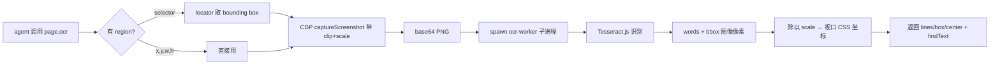

# ego-browser 本地 OCR 增强设计（2026-08-16）

状态：**已废弃**（用户转向「独立视觉理解 skill」）。本文仅作记录；替代方案见
`ego-vision/docs/superpowers/specs/2026-08-16-vision-skill-design.md`。
未实现。

## 1. 背景与问题

ego-browser 的「眼睛」主通道是 `page.snapshot()`——语义 DOM 树（含 `loc=`/`@N` 引用），本身是纯文本，并不依赖模型视觉。视觉缺口集中在两类：

1. **模型无视觉 / 视觉被禁**：`page.screenshot()` 的结果无法被模型解读，视觉通道断裂。
2. **DOM/无障碍树拿不到的内容**：canvas 绘图、视频画面、图片内嵌文字、部分自定义组件在 snapshot 里根本没有文本。

**核心驱动力是成本**：视觉模型昂贵，大部分时候其实用不到。策略 = **分层视觉**：

- **低精度、高调用量** → 本地 OCR（廉价、离线、随叫随到）。
- **高精度识别 / 图片理解 / OCR 低置信度** → 视觉模型（贵，仅按需调用）。

## 2. 目标

- 本地集成 OCR，作为廉价高调用的视觉主通道；**识别运行期完全离线、零网络、零 API key**。
- 输出**可执行**：文本 + 视口坐标，可直接 `page.mouse.click(x, y)`。
- 引擎**可插拔**；视觉模型仅作升级通道；安全验证码仍走 handoff（不绕过）。

## 3. 方案对比

| 方案 | 内容 | 优点 | 缺点 |
|---|---|---|---|
| **A. 最小 `page.ocr()`** | 只做按需 helper：截图 → 本地 OCR → 文本+坐标 | 改动最小、贴合现有 facade、可独立测试 | 依赖 agent 自觉调用；canvas 重型站点覆盖靠人 |
| **B. A + 区域定位增强（推荐）** | A 全部 + `page.ocrRegion(selector)` 按元素取框、OCR 结果直接可点、自动小字放大与置信度过滤 | 高调用量友好（区域级更快更准）、可执行 | 面稍大，但都是同一模块内的自然延伸 |
| **C. B + 自动注入 snapshot** | `page.snapshot({ ocrCanvas: true })`（默认关）：canvas/视频/无文本 img 自动 OCR 并注入语义树 | canvas 重型站点自动覆盖 | 慢、噪声、不可预测；本轮不做，留作后续可选 |
| **D. 独立 CLI `ego-ocr`** | 脱离浏览器的独立命令 | 可复用、可单测 | 多一次往返；用户已选按需 helper，本轮不做 |

**推荐 B**：`page.ocr` + `page.ocrRegion` + 可点坐标 + 分层策略；C 的自动注入留作后续可选。

## 4. 设计（方案 B）

### 4.1 架构与组件

新增独立模块 `runtime/ego-browser/ocr/`（自带依赖，与 harness 解耦）：

| 文件 | 职责 |
|---|---|
| `ocr-worker.mjs` | 子进程 CLI：stdin 收 PNG → 跑 Tesseract.js → stdout 吐 JSON。与现有 spawn chrome 模式一致 |
| `engines/tesseract.mjs` | Tesseract.js 适配器：返回 `[{ text, confidence, bbox }]` |
| `ocr-engine.mjs` | 引擎注册表/接口（可插拔）——未来可挂 RapidOCR、Windows OCR、视觉模型通道 |
| `data/` | `eng.traineddata` + `chi_sim.traineddata`，**提交仓库**（~35MB） |
| `node_modules/` | tesseract.js + 依赖，**vendored 提交**（~15-25MB） |
| `package.json` + `package-lock.json` | 固定 tesseract.js 版本 |

**harness 补丁**（`runtime/ego-browser/dist/out/index.js`，沿用 PATCHES.md 先例）：注入两个 facade 方法：

- `page.ocr({ region?, languages?, scale?, minConfidence? })`
- `page.ocrRegion(selector, { languages?, scale? })`

**配置**：`EGO_OCR_ENGINE`（默认 `tesseract`）、`EGO_OCR_LANGS`（默认 `eng+chi_sim`）、`EGO_OCR_DATA_DIR`（默认仓库内 vendored 路径，可覆盖）。

### 4.2 数据流



**坐标一致性**：OCR 返回的 `bbox/center` 是视口 CSS 像素，与现有 `page.mouse.click(x, y)` 坐标系一致，结果可直接用于点击，无需换算。

### 4.3 API 形态

```js
// 全页 OCR
const r = await page.ocr({ minConfidence: 0.4 })
// r.text                       // 拼接文本（给 agent 读）
// r.lines                      // [{ text, confidence, bbox:{x,y,w,h}, center:{x,y} }]
// r.findText('播放量')          // 返回命中行的 center/bbox（canvas 里点文字）

// 只 OCR 某区域：region 接受视口 CSS 像素 {x,y,w,h}（省略=全视口）
const r2 = await page.ocr({ region: { x: 10, y: 10, w: 300, h: 80 }, scale: 2 })

// 只 OCR 某 DOM 元素区域（按 selector 解析 bounding box，快、准、省）
const r3 = await page.ocrRegion('#video-title', { scale: 2 })
if (r3.findText('目标')) await page.mouse.click(...r3.findText('目标').center)
```

`region` 一律为视口 CSS 像素坐标 `{x, y, w, h}`；`page.ocrRegion(selector)` 内部先取元素框再走同一路径。

### 4.4 模型与依赖存储（彻底离线）

- 语言包 `eng.traineddata` + `chi_sim.traineddata`（~35MB）**直接提交进仓库**。
- tesseract.js + 依赖以 `node_modules` 形式 **vendored 提交**（仓库整体 vendored 理念一致）。
- 根 `.gitignore` 有 `node_modules/`，需为 `runtime/ego-browser/ocr/node_modules/` 加例外（嵌套 `.gitignore` 或根文件反选 `!`）。
- **运行期零网络**：任何时刻不发起网络请求；数据/依赖缺失 → 清晰报错，绝不静默下载。
- 许可证登记 `THIRD_PARTY_NOTICES.md`：tesseract.js（Apache-2.0）、tesseract.js-core（Apache-2.0）、tessdata 语言包（Apache-2.0）。

## 5. 错误处理与降级

| 情况 | 处理 |
|---|---|
| 引擎不可用（数据缺失） | 抛清晰错误，提示确认 vendored 数据/依赖完整（仓库自带，无网络获取） |
| 引擎不可用（运行时失败） | 自动重试 1 次，仍败则报错并提示升级通道 |
| 低置信度 | 结果带 `confidence`，agent 用 `minConfidence` 过滤（默认 0.5，低精度场景可下调） |
| 超时 | 有界等待（默认 15s），超时返回已得部分结果 |
| worker 崩溃 | 自动重试 1 次，仍败则报错 |
| 坐标越界 | 裁剪到视口，避免点击到窗口外 |

**降级链**：本地 OCR（默认）→ 视觉模型（高精度/图片理解/OCR 低置信度，按需）→ handoff（安全验证码）。安全验证码（wappass/滑块/reCAPTCHA）仍按 operating-preferences 规则 3 handoff 给用户，**不用 OCR 绕过**；但页面正常展示的文字（如屏幕上的验证码/票号）用 OCR 读是允许的。

## 6. 边界（本期不做）

- snapshot 自动注入（方案 C）→ 后续可选开关。
- 独立 `ego-ocr` CLI → 引擎模块天然可复用，后续再说。
- 视频流逐帧 OCR（screencast）→ 后续。
- 高精度引擎（RapidOCR/Paddle）→ 引擎接口已预留，按需再插。

## 7. 变更文件清单

| 文件 | 变更 |
|---|---|
| `runtime/ego-browser/ocr/ocr-worker.mjs` | 新增：子进程 OCR CLI |
| `runtime/ego-browser/ocr/ocr-engine.mjs` | 新增：引擎注册表/接口 |
| `runtime/ego-browser/ocr/engines/tesseract.mjs` | 新增：Tesseract.js 适配器 |
| `runtime/ego-browser/ocr/data/` | 新增：`eng.traineddata` + `chi_sim.traineddata`（vendored） |
| `runtime/ego-browser/ocr/node_modules/` | 新增：tesseract.js + 依赖（vendored） |
| `runtime/ego-browser/ocr/package.json` + `package-lock.json` | 新增：固定依赖版本 |
| `runtime/ego-browser/dist/out/index.js` | 补丁：注入 `page.ocr` / `page.ocrRegion`；PATCHES.md 记录 |
| `.gitignore` | 为 `runtime/ego-browser/ocr/node_modules/` 加例外 |
| `THIRD_PARTY_NOTICES.md` | 登记 tesseract.js / tesseract.js-core / tessdata 许可证 |
| `skills/ego-browser/references/facade.md` | 补 `page.ocr` / `page.ocrRegion` 文档 |
| `skills/ego-browser/SKILL.md` | 新增「视觉分层」章节（OCR / 视觉模型 / handoff 何时用） |
| `skills/ego-browser/references/operating-preferences.md` | 补成本策略 + 「不绕过安全验证码」边界 |
| `README.md` | 使用说明同步 |
| `scripts/verify-ocr.mjs` | 新增：OCR 冒烟 |

## 8. 测试 / 验证

1. **单元**：tesseract 适配器对**合成夹具图**（程序生成含已知中英文文本的 PNG）断言识别文本与坐标。
2. **新冒烟** `node scripts/verify-ocr.mjs`：无头浏览器渲染含 canvas 绘制文字 + 图片内嵌文字的页面 → `page.ocr` / `page.ocrRegion` 找到 → 断言坐标可点。
3. **回归**：`node scripts/verify.mjs` 仍 PASS；harness 补丁不破坏现有 facade。
4. **区域**：只 OCR 指定区域，断言不含区域外文字。

## 9. 验收标准

- [ ] 运行期零网络请求完成 OCR（彻底离线）。
- [ ] `page.ocr` / `page.ocrRegion` 可用，返回文本 + 坐标。
- [ ] OCR 坐标可直接 `page.mouse.click(x, y)` 点击。
- [ ] 中英文通用（eng + chi_sim）。
- [ ] 引擎接口可插拔（`EGO_OCR_ENGINE` 可切换）。
- [ ] `node scripts/verify.mjs` 仍 PASS，`node scripts/verify-ocr.mjs` PASS。
