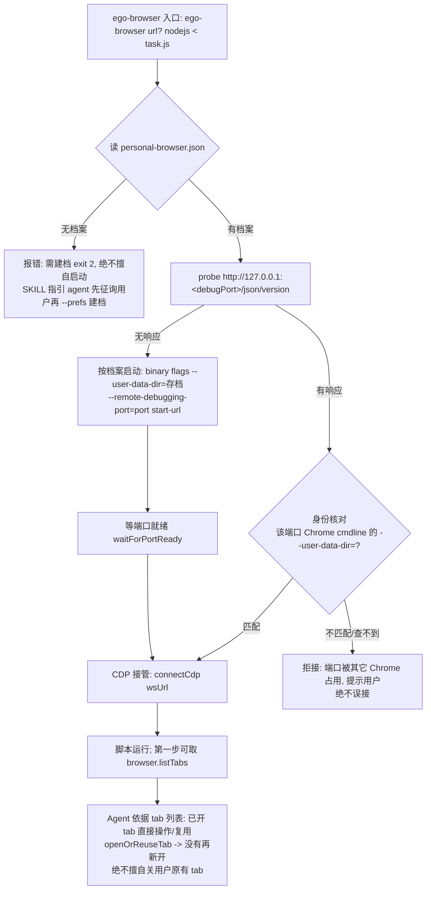

# ego-browser 个人接管模式设计（Personal Takeover Mode）

- 日期：2026-09-06
- 状态：设计已获用户确认（§1–§8 逐段认可）
- 关联：运行时 `runtime/ego-linux/`（vendored，改动记 `runtime/PATCHES.md`）；技能本体 4 份副本同步

## 1. 背景与目标（Why）

现状：运行时以「ego 专用隔离 profile（`~/.local/share/ego-lite-linux`，窗口标 `ego lite —
agent`、`--class=ego-lite-linux`）+ task space 隔离」为默认。每次浏览器任务冷启动会弹出一个
`about:blank` 空窗口（用户观察：触发技能时出现"预热/健康检查"式空白窗），不接管用户已开着的
Chrome，也不驱动用户自己的 workspace profile；默认调试端口 9222 与用户自开的 Chrome 冲突时
还会"礼貌换端口另起一台"，造成多浏览器并存。

用户期望（原文归纳）：

1. 技能触发**不弹空浏览器**；健康/状态检查应**静默**、不启动、无窗口副作用。
2. 开始操作前**先检查是否已有浏览器在跑**：有则通过 CDP **接管**（用
   `http://127.0.0.1:9222/json/version` 的 `webSocketDebuggerUrl` 确认）。
3. 接管后**先取 tab 列表**，避免重复/多开用户所需页面。
4. 没有在跑的浏览器时，**按用户惯常参数启动**（惯常参数以"档案"形式落盘，读取优先；无档案先
   向用户确认，**不写死示例命令**）。
5. 只有当现有能力不足时才考虑集成 playwright-cli-portable（本项目结论：暂不需要）。

用户明确：知道 ego-browser 原本设计用 workspace/task space 隔离工作内容，但个人希望该技能**按
上述期望工作**，而非盲目遵循 ego-browser 默认规则。

> **登录态复用 = 档案 profile 自带（用户确认：只要接管能复用登录态、能直接操作已开 tab 即可）**
> 要复用的登录/会话/cookie 都在档案指定的 `chrome_workspace` 里。接管「已经在跑的
> chrome_workspace 实例」时，直接用该实例**已加载的会话**，已开的 tab 列出后**直接操作/复用**；
> 没有实例时按档案启动**同一个 profile 目录**，其落盘的 cookie/登录自动加载。因此既不需要、也不
> 允许去碰「日常 Chrome 默认 profile」。

## 2. 非目标（Non-goals / YAGNI）

- **不集成 playwright-cli-portable**：ego facade 已是 Playwright 风格
  （`page.goto/locator/getBy*/snapshot/keyboard/mouse`），DOM 交互能力不缺；接管/复用诉求由
  CDP 连接 + 本设计运行层改造满足。仅当 §8 spike 证明 ego 接管不可行时才回头评估。
- 不修改上游 harness 核心语义（只在 shim/伪空间层做最小适配）。
- 不做复杂的"多窗口接管/窗口管理"。
- **不接管/不驱动、更不替用户启动/初始化「日常 Chrome 的默认 profile」**（授权边界只到档案里的
  workspace profile）。此条**不阻碍登录态复用**：会话/cookie 都在档案 `chrome_workspace`，见 §1。
- 不改变 isolated 模式既有行为（CI/隔离场景保底）。

## 3. 关键决策（Decisions）

- **D1 双模式**：`personal`（默认）/ `isolated`（显式 `--isolated` 或
  `EGO_LINUX_PERSONAL=0`）。
- **D2 统一无感入口**：探测→接管→列 tab 与探测→按档案启动→列 tab 合成一个入口；健康探测只
  probe、不 launch、不弹窗。
- **D3 持久化启动档案** `personal-browser.json`：读取优先 → 无则先征询用户 → 确认后建档 →
  每次启动前读取；不把示例命令写死进代码/SKILL。
- **D4 身份核对**：接管前验证该端口 Chrome 的 `--user-data-dir=` 与档案一致，杜绝误接。
- **D5 授权边界**：只驱动档案 workspace profile——**登录态复用即来自该 profile**：接管已开实例
  直接用其已加载会话与现有 tab；无实例则按档案启动同一 profile，落盘 cookie/登录自动可用。ego
  自启实例可 `--stop`；外部已存在实例**绝不杀**（只"断开"）、不 `--import-chrome-profile`、不改其
  profile 数据。
- **D6 就地驱动现有 tab = 非隔离伪空间**（`browserContextId=null`），复用运行时既有 fallback
  （`adoptStartupTarget` / `readoptRestoredPages` 的无 context 空间路径），不新建隔离 context。

## 4. 总体流程



> **登录态/会话复用（用户确认要点）**：接管后实例已加载的用户登录/会话**直接可用**；`chrome_workspace`
> 里已开的页面 tab 由 `browser.listTabs()` 列出后**直接操作/复用**，不重复开新页。

## 5. CLI（`runtime/ego-linux/bin/ego-browser.mjs`）

- `--status`：**纯探测报告**（保持不启动浏览器）。输出扩展为：
  `{ running, ...现有字段, personal: { prefsExists, debugPort, running, ours, attachable, reason? } }`。
- `ego-browser [--url <url>|<裸url>] [--headless] nodejs < task.js` 与裸 `ego-browser nodejs <
  task.js`：内部统一走 `resolveBackingBrowser()`（见 §7）。脚本环境第一步即可调
  `browser.listTabs()`。保持 `--headless` 语义（仅对 personal/isolated 的启动行为生效；
  接管模式忽略 headless——接管的是用户已开的可见浏览器）。
- 新增：
  - `--prefs <json>`：写入/覆盖启动档案（显式操作，供"用户确认后建档"用）。
  - `--prefs-clear`：清除启动档案。
  - `--isolated`：走旧 ego 专用 profile 行为（等价 `EGO_LINUX_PERSONAL=0`）。
- `--stop` 语义（personal 模式）：
  - 该实例**由 ego 启动**（有记账 pid）→ 优雅 `Browser.close` 并清记账；
  - 该实例是**外部已存在的用户浏览器**（仅接管）→ 只"断开"并输出
    `已断开，未关闭你的浏览器`，**绝不 kill/taskkill**。
- 既有 `--open / --prune-spaces / --spaces / --import-chrome-profile /
  --install-desktop-entry` 在 personal 默认下要么禁用要么明确归入 isolated 模式（实现时逐一定义，
  默认归 isolated；避免它们意外作用于用户 workspace profile）。

## 6. 启动档案（新增 `runtime/ego-linux/src/personal-prefs.mjs`）

- 文件：`STATE_DIR/personal-browser.json`（`STATE_DIR` 同 `paths.mjs`，可由
  `XDG_STATE_HOME` 覆盖以便隔离测试）。
- 结构：

```json
{
  "binary": "C:/Program Files/Google/Chrome/Application/chrome.exe",
  "userDataDir": "C:/Users/quincy/workspace/mywork/chrome_workspace",
  "debugPort": 9222,
  "flags": [],
  "confirmedAt": "2026-09-06T00:00:00.000Z",
  "source": "user-confirmed"
}
```

  - 路径统一正斜杠（运行时要求）。
  - `flags`：用户惯常附加参数（如 `--disable-web-security`、代理开关等），逐项列入。
  - `userDataDir` 同时用于身份核对（§7）与磁盘存在性校验。
- API：`loadPrefs() -> prefs|null`、`savePrefs(prefs)`、`clearPrefs()`、
  `profileMatches(cmdline, userDataDir)`。
- **读取优先、无则征询、确认建档、之后每次启动前读取**。任何入口在"无档案且需要浏览器"时
  **必须**报"需建档"并退出（exit 2），**禁止**用任何内置默认命令启动浏览器。

## 7. `chrome.mjs` 改造

- 新增 `resolveBackingBrowser({ headless, startUrl })`，分流：
  1. `EGO_LINUX_CDP_URL` 已设 → 直接接管（沿用现有钩子，语义不变）。
  2. isolated 模式 → 旧 `ensureBrowser()` 全逻辑（ego profile + class 单实例）。
  3. personal 默认 → §4 流程：
     - 读档案（无 → 抛"需建档"错误，exit 2）；
     - probe 档案 `debugPort`（复用现有 `probe()`，1.5s 超时，**只 probe 不 launch**）；
     - 有响应 → **身份核对**：调用新增泛化的 `findChromeMainOnPort(port)`（win32 用现有 CIM
       枚举模式，按 `--remote-debugging-port=<port>` + 非 `--type=` 过滤主进程），对每个命中
       进程用 `profileMatches(cmdline, userDataDir)` 比对；命中 → 接管；未命中 → 拒接并给出
       提示（含实际占用者 user-data-dir，便于用户判断）；
     - 无响应 → **按档案启动**：`spawn(binary, [...flags, --user-data-dir=<userDataDir>,
       --remote-debugging-port=<debugPort>, startUrl])`，detached；复用 `waitForPortReady` 等
       端口就绪；把 pid/port 写入**独立记账文件**（新常量 `PERSONAL_STATE_FILE`，用于 `--stop`
       判定"可否安全关闭"）。**不**对该 profile 施加 ego 的 `--class` /
       `neutralizeZoom` / crash-mark 清理等最小干预项（这是用户浏览器；最多做窗口尺寸/缩放等
       驱动必需项，若需要则单独说明并征询）。
- 现有 ego 专属枚举器/launch 工具保留给 isolated 模式。
- 健康探测统一走"只 probe 不 launch"；`browserStatus()` 增加 personal 分支报告。

## 8. shim「伪空间」适配与 spike（最大技术风险）

现状：harness 需要"被选中的 task space + active tab"；`listTabs` scope 到 space 的
`browserContextId` 或 targetId 集合；`createTab` 默认进选中 space；下载/光标等按 space context
定向。`task-spaces.mjs` 已存在"无 context 空间"路径（restored / fallback：
`browserContextId=null`，按 targetIds 归属，tab 落默认 context 共享登录态）——接管模式复用它。

接管模式目标（D6）：

- 建立时把用户默认 context 的**全部现有 page tab** 登记进一个**非隔离伪空间**
  （`browserContextId=null`），不关闭、不新建隔离 context。
- `listTabs` → 该伪空间全部现有 tab（标题/URL/激活态）。
- `openOrReuseTab(url)` → 先按 URL/语义在伪空间内**复用现有 tab**；没有再
  `Target.createTarget` 新开（默认 context，共享登录态）；新开的 tab 记入伪空间 targetIds。
- `switchTab` 伪空间内切换；`closeTab` 只关本任务新开/重试产生的 tab——**绝不擅自关用户原有 tab**。
- cursor / `handOff` / `takeOver` / `setTaskState` 语义降级为"把当前 tab 留给你 / 接回继续"，
  不接管窗口归属。

**Spike（实现第一步，先验证再写死实现）**：接到用户的 9222 Chrome（或其隔离测试副本）→ 依次跑
`listTabs / switchTab / openOrReuseTab / snapshot / goto`，确认 facade 对默认 context 现有 tab
全部可用。若个别 API 依赖"带 context 的 space"而失败，则在伪空间上打最小补丁（
`browserContextId=null` + targetIds 登记，参照 `readoptRestoredPages` 既有 fallback）。

## 9. 技能层改写（SKILL.md 等 4 份副本 + references）

落地用户 5 条期望 + 建档机制，重写为"接管 SOP"：

1. **开场不预热**：任何浏览器任务第一步就是"静默探测 + 接管/直达启动"；绝不单独 `--open` 或空
   脚本预热；健康检查只经无副作用的 `--status`。
2. **接管后先列 tab**：脚本首行 `console.log(await browser.listTabs())`，agent 据此复用现有 tab、
   决定是否开新页 → 避免重复多开用户所需页面。
3. **首用建档 SOP（硬规则）**：`--status` 报 `prefsExists:false` → agent **停下，用中文征询**
   用户惯常启动命令 → 用户确认 → `ego-browser --prefs <...>` 建档 → 继续。禁止猜默认命令。
4. **授权边界写死**：只驱动档案 workspace profile（接管即复用其已加载登录态/已开 tab，无需也
   不允许碰日常默认 profile）；`--stop` 只对 ego 自启实例；外部用户实例绝不杀/不 import/不改其数据。
5. **tab 卫生**：不关用户原有 tab，只清理本任务新开/重试产生的 tab。
6. **人工步骤 SOP**：验证码/登录等把当前 tab 留给你（不关闭、不 `--stop`），完成后 agent 接回
   同一 tab 继续。

需同步的副本与文件：

- `skills/ego-browser/`（权威源）
- `runtime/skills/ego-browser/`（运行时默认 skill workspace，`EGO_BROWSER_AGENT_WORKSPACE`）
- `.copilot/skills/ego-browser/`、`~/.copilot/skills/ego-browser/`（生效副本）
- references：`operating-preferences.md`（授权边界/登录态/`--stop` 语义段落）、`windows.md`
  （新命令）、`install.md`、`task-spaces.md`（接管模式下 task space 语义降级说明）
- `AGENTS.md` 相关描述
- runtime 改动记 `runtime/PATCHES.md`

## 10. 错误处理与边界（Error handling）

- 端口被无关进程占用（含日常 Chrome 开了 9222）→ 拒接 + 提示（含占用者身份）；绝不误接。用户
  可改档案 debugPort（显式建档操作）后再试。
- 档案指向的 profile 正被另一个非该端口的 Chrome 实例使用 → 提示先关闭那个或用档案指定端口。
- 无档案且需要浏览器 → 报"需建档"，exit 2，不擅自启动。
- `--stop` 对外部接管实例只"断开"。
- probe/连接沿用现有超时与重试（1.5s probe、3 次 open 重试、20s waitForPortReady）。

## 11. 测试策略

- 新增 `scripts/verify-personal.mjs`：在隔离环境回归
  （`EGO_LINUX_PROFILE`/`XDG_STATE_HOME` + 临时"伪 workspace profile" userDataDir + 临时端口，
  绝不碰真实 chrome_workspace 数据）。用例：建档 → 启动（首窗直达目标页）→ 列 tab → 复用/去重 →
  新开 → 关闭本任务 tab → 外部实例"只断开不杀"断言 → `--prefs-clear`。
- 真实接管只读冒烟（可选、需用户 Chrome）：`--status` 报 attachable → 只读列 tab/snapshot 验证。
- `verify.mjs`（isolated 回归）保持通过不破。
- 完成前跑验证并贴证据（证据先行）。

## 12. 落地顺序（供 writing-plans 展开）

1. spike：伪空间接管可行性（§8）——**先做，结果决定 §8 具体补丁范围**。
2. `personal-prefs.mjs` + 单测。
3. `chrome.mjs`：`resolveBackingBrowser` / 身份核对 / 按档案启动 / personal 记账 / `--stop` 语义。
4. CLI：`--prefs`/`--prefs-clear`/`--isolated`/`--status` 扩展。
5. shim/伪空间适配（依 spike 结论）。
6. 技能 4 份副本 + references 改写。
7. `verify-personal.mjs` + 全量验证；`runtime/PATCHES.md` 记账；AGENTS.md 更新。

## 13. 风险与开放项

- **R1（最高）** 伪空间接管需 spike 证实；失败则回退到"最小接管"（仅 listTabs/switchTab/goto
  稳定，其余 API 标注受限）或评估 playwright-cli。
- **R2** 用户 workspace profile 属"用户浏览器"，一切 profile 文件改动须克制并显式说明。
- **R3** 多副本同步遗漏导致生效技能与新行为不一致——以 `~/.copilot/skills/ego-browser/` 为生效
  校验目标，安装脚本若存在则复用。
- **R4** personal 默认后，原依赖 isolated 的脚本/文档需同步迁移说明。

## 实现状态

- **已实现（2026-09-06）**，提交：`3b6181e`（spike）、`a4b331f`（prefs 模块）、`4de544d`
  （resolveBackingBrowser）、`febaaf0`（CLI/shim 接线）、`9412c22`（伪空间 adopt）、`4dd41ef`
  （verify-personal E2E + 旧 verify 强制 isolated）、`7d7343c`（技能四份副本 + references +
  AGENTS）。
- spike 结论 = PASS（`docs/superpowers/spikes/2026-09-06-personal-takeover-findings.md`）。
- 回归证据：`node --test runtime/ego-linux/test/personal-prefs.test.mjs`（4/4）、
  `node --test runtime/ego-linux/test/chrome-personal.test.mjs`（2/2）、
  `node scripts/verify-personal.mjs`（PASS）、`node scripts/verify.mjs`（isolated PASS exit 0）。
- 真实 chrome_workspace 只读冒烟（Task 8 Step 2）：需用户在场，**待办**。
